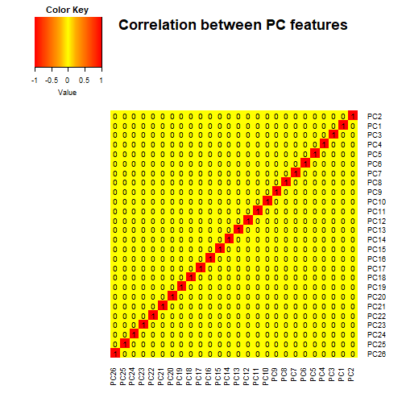

# Machine learning

In this project we were supposed to create a classificator, which can be used to predict the quality of a workout.

## Data preparation

First, we have to download the training dataset, the testing dataset and load required libraries.


```r
require(caret); require(ggplot2); require(gplots); require(dplyr); require(randomForest)
set.seed(2018-07-29)
```


```r
download.file("https://d396qusza40orc.cloudfront.net/predmachlearn/pml-training.csv", "train.csv")
download.file("https://d396qusza40orc.cloudfront.net/predmachlearn/pml-testing.csv", "test.csv")

train <- read.csv("train.csv"); test <- read.csv("test.csv")

x <- train[, -160]; y <- train[, 160]
```

## Feature selection

First, we remove features which consist of at least 95% elements classified as NA. 


```r
d <- dim(x)
rm_1 <- unname(apply(x, 2, function(x) {sum(100 * is.na(x)) / d[1]}) > 95)
rm_1 <- which(rm_1, arr.ind = TRUE)
```

Next, we exclude features categorized as NZV. Their variance is relatively low, and therefore, we can assume that they are not very influential.


```r
rm_2 <- nearZeroVar(x, saveMetrics = TRUE)$nzv
rm_2 <- which(rm_2, arr.ind = TRUE)
```

Now, we can manually investigate the rest.

- **X**, we do need any index. The rows are going to be randomized anyway.
- **user_name**, the test dataset might include data of different users. This feature is redundant as well.
- **raw_timestamp_part_1**, it describes when somebody started a workout. Everybody has a different lifestyle, and therefore, it is  far fetched to assume that a morning workout is better than the evening one.
- **cvtd_timestamp**, a redundant variable (the same as raw_timestamp_part_1).
- **num_window**, this is rather a technical feature, it is not associated with a workout but with equipment.

We can now remove the above mentioned variables.


```r
rm_3 <- c(1, 2, 3, 5, 7)
```

We combine the three lists.


```r
rm <- sort(unique(c(rm_1, rm_2, rm_3)))
```

Using there procedures we were able to remove 106 features. Furthermore, we have only numeric variables now. What is interesting, not even a single feature can be characterized by a normal distribution.


```r
shapiro <- apply(x[sample(nrow(x), 5000), -rm], 2, shapiro.test)
length(which(unname(sapply(shapiro, function (x) x$p.value)) > 0.05, arr.ind = TRUE))
```

```
[1] 0
```

Therefore, we should apply "center", "scale" and BoxCox" transformations. Furthermore, missing values, which can appear in the test set, might cause some problem. It is possible to impute them using the "knnImpute" transformation. Finally, the dataset consists of variables from different detectors, which are probably highly correlated. Each of them depict 3D data, and therefore, it might be a good idea to rotate the data, and project it onto a n-dimensional plane, while keeping ca. 95% of their variation. 


```r
preProc <- preProcess(x[, -rm], method = c("BoxCox", "center", "scale", "knnImpute", "pca"), thresh = 0.95)
processed <- predict(preProc, x[, -rm])
```

The number of features decreased to 26. Unfortunately, there was no significant improvement in the normality test. However, this was all we could do without changing the training data too much. The correlation between PC values is presented below. We lost some interpretability but, at the same time, we managed to keep almost all of the variance in only 26 features.


```r
c <- round(cor(processed, method = "pearson"), 2)
col_p <- colorRampPalette(c("red", "yellow", "red"))(n = 299)
col_b = c(seq(-1.00, -0.25, length = 100), seq(-0.24, 0.24, length = 100), 
          seq(0.25, 1.00, length = 100))
heatmap.2(c, cellnote = c, trace="none", density.info="none", symm = TRUE,
          dendrogram = "none", notecol = "black", col = col_p,
          breaks = col_b, main = "Correlation between PC features")
```



To sum up, to process the data we remove `rm` columns. Next, to preprocess it, the `preProc` model should be implemented.  

## Model selection

In the second part of the study, we create a single model based on the "random forest" technique.


```r
foldNo <- 25
set <- mutate(processed, y)
position <- dim(set)[2]
fold <- createFolds(y = set$y, k = foldNo, list = TRUE, returnTrain = TRUE)
```


```r
accuracy <- NULL
table <- NULL;

for(i in 1:foldNo) {
    model <- randomForest(y ~ ., data = set[fold[[i]], ])
    confusion <- confusionMatrix(predict(model, set[-fold[[i]], -position]), set[-fold[[i]], position])
    ifelse(is.null(accuracy), accuracy <- confusion$overall[[1]], accuracy <- accuracy + confusion$overall[[1]])
    ifelse(is.null(table), table <- confusion$table, table <- table + confusion$table)
}

accuracy <- accuracy / foldNo
table <- table / sum(table)
```

The accuracy, after cross-validation, is 0.9837414. The confusion matrix, divided by the number of investigated test samples, is presented below.


```r
round(table, 5)
```

```
##           Reference
## Prediction       A       B       C       D       E
##          A 0.28259 0.00255 0.00031 0.00025 0.00005
##          B 0.00036 0.18918 0.00189 0.00005 0.00025
##          C 0.00097 0.00158 0.17098 0.00448 0.00087
##          D 0.00031 0.00000 0.00112 0.15890 0.00056
##          E 0.00015 0.00020 0.00010 0.00020 0.18209
```

## Predictions

To predict values using the training set, a few modifications must be made first.


```r
model <- randomForest(y ~ ., data = set)
results <- predict(preProc, test[, -c(rm, dim(test)[2])])
predict(model, results)
```

```
##  1  2  3  4  5  6  7  8  9 10 11 12 13 14 15 16 17 18 19 20 
##  B  A  A  A  A  E  D  B  A  A  B  C  B  A  E  E  A  B  B  B 
## Levels: A B C D E
```

## Conclusions

The predictor was able to classify 19 out of 20 samples correctly. However, using the confusion matrix it was possible to manually correct this error and assume the second highest probability (B instead of A). Finally, the accuracy was 95% (19/20).
